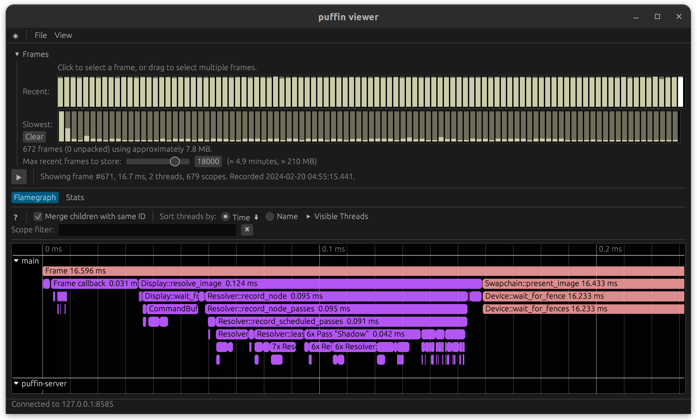

Vulkan Graph Driver
===================

[](https://crates.io/crates/vk-graph)
[](https://docs.rs/vk-graph)
[](https://attackgoat.github.io/vk-graph)

_vk-graph_ is a high-performance [Vulkan](https://www.vulkan.org/) driver for the Rust programming
language featuring automated resource management and execution. It is _blazingly_-fast, built for
real-world use, and supports modern Vulkan commands[^modern].

```toml
[dependencies]
vk-graph = "0.14"
```

[*Changelog*](https://github.com/attackgoat/vk-graph/blob/main/CHANGELOG.md)

<br>

## Overview

_vk-graph_ supports desktop, mobile, and AR/VR platforms in headless, windowed, or full-screen
modes. An [accessory crate](crates/vk-graph-window/README.md) is provided for `winit` support:

```rust
use vk_graph_window::{Window, WindowError};

fn main() -> Result<(), WindowError> {
    Window::new()?.run(|frame| {
        // It's time to do some graphics! 😲
    })
}
```

<br>

## Usage

_vk-graph_ provides a fully-generic graph structure for statically typed access to resources used
while rendering. The `Graph` structure allows Vulkan smart pointer resources to be bound as
"nodes" which may be used by shader pipelines. The graph supports swapchain integration and may be
used to execute custom command streams.

Features of the graph:

 - Compute, graphics, and ray tracing pipelines
 - Automatic Vulkan management (render passes, subpasses, descriptors, pools, _etc._)
 - Automatic render pass scheduling, re-ordering, merging, with resource aliasing
 - Interoperable with existing Vulkan code
 - Optional [shader hot-reload](crates/vk-graph-hot/README.md) from disk

Example code:

```rust
graph
    .begin_cmd()
    .debug_name("Fancy new algorithm for shading a moving character who is actively on fire")
    .bind_pipeline(&gfx_pipeline)
    .shader_resource_access(0, prev_image, AccessType::FragmentShaderReadColorInputAttachment)
    .shader_resource_access(1, some_image, AccessType::FragmentShaderReadOther)
    .shader_resource_access(3, fire_buffer, AccessType::FragmentShaderReadUniformBuffer)
    .color_attachment_image(0, swapchain_image, LoadOp::CLEAR_BLACK_ALPHA_ZERO, StoreOp::Store)
    .depth_stencil_attachment_image(depth_image, LoadOp::Load, StoreOp::DontCare)
    .record_cmd(move |cmd| {
        cmd
            .push_constants(0, some_u8_slice)
            .draw(6, 1, 0, 0);
    });
```

<br>

## Optional features

_vk-graph_ puts a lot of functionality behind optional features in order to optimize
compile time for the most common use cases. The following features are
available.

- **`checked`** *(enabled by default)* — Runtime validation of common misuse patterns
  (missing access declarations, buffer bounds, image aspects) that the Vulkan Validation Layer
  cannot catch, including cross-graph node ownership checks. Disable for zero-overhead in
  validated releases.
- **`loaded`** *(enabled by default)* — Support searching for the Vulkan loader manually at runtime.
- **`linked`** — Link the Vulkan loader at compile time.
- **`ash-molten`** — Enable `ash-molten` support for MoltenVK-based platforms.
- **`parking_lot`** *(enabled by default)* — Use `parking_lot` synchronization primitives.
- **`profile-with-*`** — Use the specified profiling backend:
  `profile-with-puffin`, `profile-with-optick`, `profile-with-superluminal`, or
  `profile-with-tracy`

<br>


## Debug Logging

This crate uses [`log`](https://crates.io/crates/log) for low-overhead logging.

To enable logging, set the `RUST_LOG` environment variable to `trace`, `debug`, `info`, `warn` or
`error` and initialize the logging provider of your choice. Examples use
[`pretty_env_logger`](https://docs.rs/pretty_env_logger/latest/pretty_env_logger/).

_You may also filter messages, for example:_

```bash
RUST_LOG=vk_graph::driver=trace,vk_graph=warn cargo run --example ray_tracing
```

```
TRACE vk_graph::driver::instance > created a Vulkan instance
DEBUG vk_graph::driver::physical_device > physical device: NVIDIA GeForce RTX 3090
DEBUG vk_graph::driver::physical_device > extension "VK_KHR_16bit_storage" v1
DEBUG vk_graph::driver::physical_device > extension "VK_KHR_8bit_storage" v1
DEBUG vk_graph::driver::physical_device > extension "VK_KHR_acceleration_structure" v13
...
```

<br>

## Performance Profiling

This crate uses [`profiling`](https://crates.io/crates/profiling) and supports multiple profiling
providers. When not in use profiling has zero cost.

To enable profiling, compile with one of the `profile-with-*` features enabled and initialize the
profiling provider of your choice.

_Example code uses [puffin](https://crates.io/crates/puffin):_

```bash
cargo run --features profile-with-puffin --release --example vsm_omni
```



<br>

## Quick Start

Included are some examples you might find helpful:

- [`hello_world.rs`](crates/vk-graph-window/examples/hello_world.rs) — Displays a window on the
  screen. Please start here.
- [`triangle.rs`](examples/triangle.rs) — Shaders and full setup of index/vertex buffers; < 100 LOC.
- [`shader-toy/`](examples/shader-toy) — Recreation of a two-pass Shadertoy using the original
  shader code.

See the [example code](examples/README.md),
[documentation](https://docs.rs/vk-graph/latest/vk_graph/), or helpful
[guide book](https://attackgoat.github.io/vk-graph) for more information.

**_NOTE:_** Required development packages and libraries are listed in the _guide_. All new users
should read and understand the guide.

<br>

#### License

<sup>
Licensed under either of <a href="LICENSE-APACHE">Apache License, Version
2.0</a> or <a href="LICENSE-MIT">MIT license</a> at your option.
</sup>

<br>

<sub>
Unless you explicitly state otherwise, any contribution intentionally submitted
for inclusion in this crate by you, as defined in the Apache-2.0 license, shall
be dual licensed as above, without any additional terms or conditions.
</sub>

[^modern]: Modern Vulkan usage means no pixel queries. Anything else unsupported is due to there
being better options, no current need, or no interest. Please open an issue.
