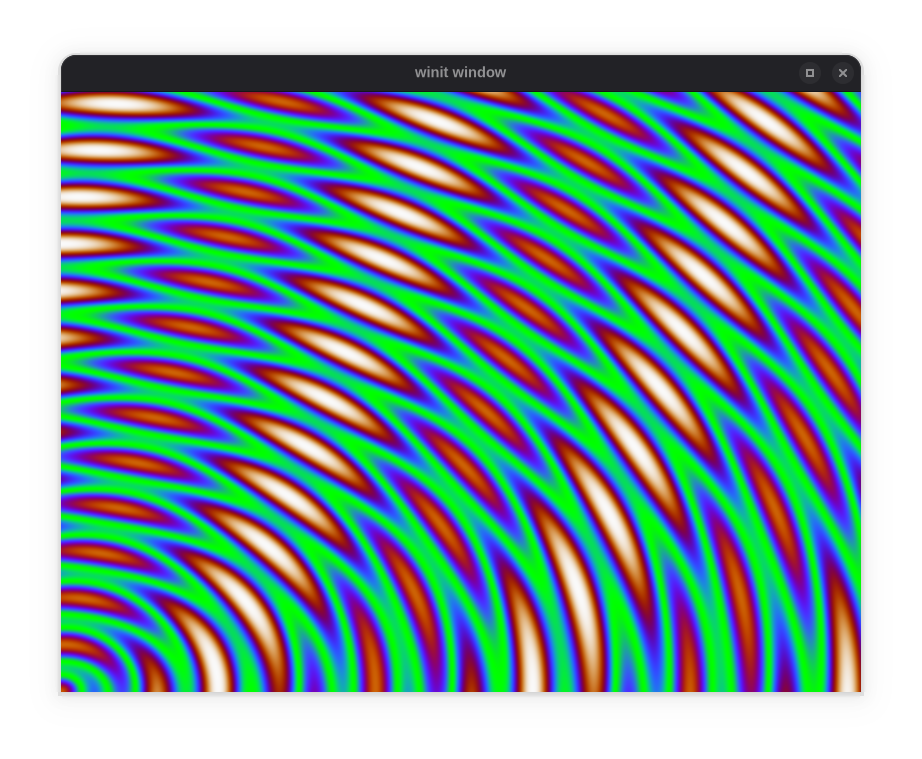

# _vk-graph Hot_ Example Code

## Getting Started

Hot-reloading shader pipelines are drop-in replacements for regular shader pipelines. Use the code
below to get started.

See the [README](../README.md) for more information.

## Example Code

| Example | Instructions | Preview |
| --- | --- | :---: |
| [glsl.rs](glsl.rs) | <pre>cargo run --example glsl</pre> |  |
| [hlsl.rs](hlsl.rs) | <pre>cargo run --example hlsl</pre> |  |
