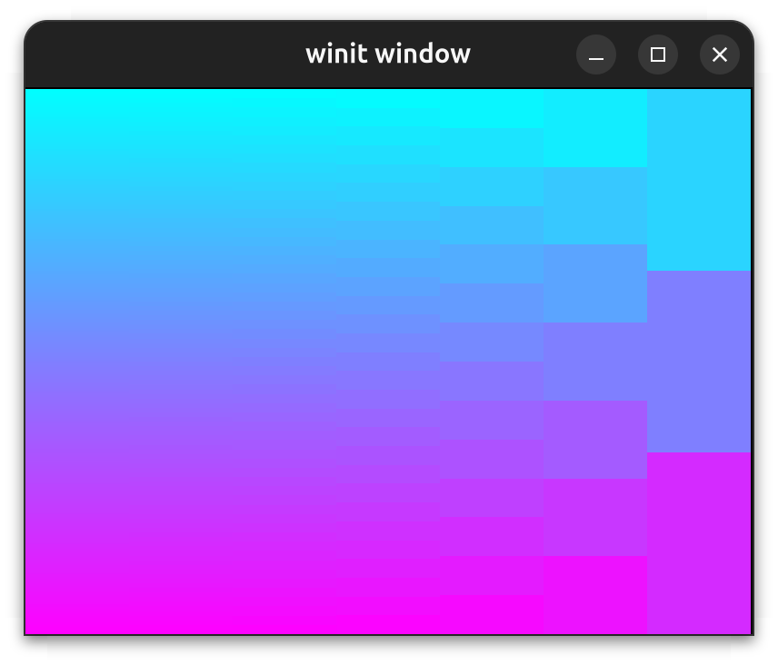
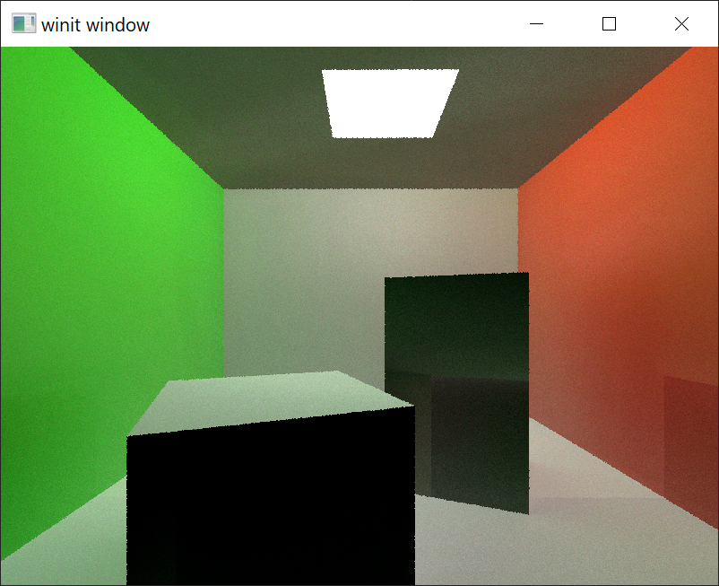

# _vk-graph_ Example Code

## Getting Started

A helpful [guide](https://attackgoat.github.io/vk-graph) is available which describes _vk-graph_
types and functions.

See the [README](../README.md) for more information.

## Example Code

| Example | Instructions | Preview |
| --- | --- | :---: |
| [aliasing.rs](aliasing.rs) | <pre>cargo run --example aliasing</pre> | _See console output_ |
| [cpu_readback.rs](cpu_readback.rs) | <pre>cargo run --example cpu_readback</pre> | _See console output_ |
| [debugger.rs](debugger.rs) | <pre>cargo run --example debugger</pre> | _See console output_ |
| [min_max.rs](min_max.rs) | <pre>cargo run --example min_max</pre> | _See console output_ |
| [mip_compute.rs](mip_compute.rs) | <pre>cargo run --example mip_compute</pre> | _See console output_ |
| [baked.rs](baked.rs) | <pre>cargo run --example baked</pre> | _See console output_ |
| [subgroup_ops.rs](subgroup_ops.rs) | <pre>cargo run --example subgroup_ops</pre> | _See console output_ |
| [hello_world.rs](../crates/vk-graph-window/examples/hello_world.rs) | _See [vk-graph-window](../crates/vk-graph-window/README.md)_ |  |
| [app.rs](app.rs) | <pre>cargo run --example app</pre> |  |
| [triangle.rs](triangle.rs) | <pre>cargo run --example triangle</pre> |  |
| [vertex_layout.rs](vertex_layout.rs) | <pre>cargo run --example vertex_layout</pre> |  |
| [bindless.rs](bindless.rs) | <pre>cargo run --example bindless</pre> |  |
| [image_sampler.rs](image_sampler.rs) | <pre>cargo run --example image_sampler</pre> |  |
| [egui.rs](egui.rs) | <pre>cargo run --example egui</pre> |  |
| [imgui.rs](imgui.rs) | <pre>cargo run --example imgui</pre> |  |
| [font_bmp.rs](font_bmp.rs) | <pre>cargo run --example font_bmp</pre> |  |
| [mip_graphics.rs](mip_graphics.rs) | <pre>cargo run --example mip_graphics</pre> |  |
| [multipass.rs](multipass.rs) | <pre>cargo run --example multipass</pre> |  |
| [multithread.rs](multithread.rs) | <pre>cargo run --example multithread --release</pre> |  |
| [msaa.rs](msaa.rs) | <pre>cargo run --example msaa</pre> Multisample anti-aliasing |  |
| [rt_triangle.rs](rt_triangle.rs) | <pre>cargo run --example rt_triangle</pre> |  |
| [ray_tracing.rs](ray_tracing.rs) | <pre>cargo run --example ray_tracing</pre> |  |
| [vsm_omni.rs](vsm_omni.rs) | <pre>cargo run --example vsm_omni</pre> Variance shadow mapping for omni/point lights |  |
| [ray_omni.rs](ray_omni.rs) | <pre>cargo run --example ray_omni</pre> Ray query for omni/point lights |  |
| [transitions.rs](transitions.rs) | <pre>cargo run --example transitions</pre> |  |
| [skeletal-anim/](skeletal-anim/src/main.rs) | <pre>cargo run -p skeletal-anim</pre> Skeletal mesh animation using glTF |  |
| [shader-toy/](shader-toy/src/main.rs) | <pre>cargo run -p shader-toy</pre> |  |
| [vr/](vr/src/main.rs) | <pre>cargo run -p vr</pre> |  |

## Additional Examples

The following packages offer examples for specific cases not listed here:

- [crates/vk-graph-hot](../crates/vk-graph-hot/examples/README.md): Shader pipeline hot-reload
- [attackgoat/mood](https://github.com/attackgoat/mood): FPS game prototype with level loading and
  multiple rendering backends
- [attackgoat/jw-basic](https://github.com/attackgoat/jw-basic): BASIC interpreter with graphics
  commands powered by _vk-graph_
