<!--
Graph fixture. Unstable dev-only format.
structural makeup: mixed topology
resources: 125
commands: 49
accesses: 262
components: 1
max resource degree: 15
read edges: 175
write edges: 71
read-write edges: 16
compact dependencies: 207
compact dependencies displayed: 207
compact dependencies omitted: 0
hub resources omitted from mermaid: 0
-->

# Graph Relationship Overview

This view keeps the binary fixture complete, but collapses the Mermaid diagram to command dependencies. Read/read-only relationships are omitted, and high-degree hub resources are summarized below instead of drawn.

- Resources: 125
- Commands: 49
- Accesses: 262
- Compact dependencies: 207
- Displayed dependencies: 207
- Omitted dependencies: 0
- Omitted hub resources: 0

## Command Dependencies

Edge labels are `resources / accesses / dependency kinds`, where RAW is read-after-write, WAR is write-after-read, and WAW is write-after-write.

```mermaid
flowchart TD
  C0["cmd 0: init pose"]
  C1["cmd 1: update animation 1"]
  C2["cmd 2: update geometry"]
  C3["cmd 3: copy buffer"]
  C4["cmd 4: BLAS"]
  C5["cmd 5: TLAS"]
  C6["cmd 6: generate path ReSTIR reservoir"]
  C7["cmd 7: spatial reuse path ReSTIR reservoir"]
  C8["cmd 8: spatial reuse path ReSTIR reservoir"]
  C9["cmd 9: shade path ReSTIR reservoir"]
  C10["cmd 10: copy compute depth buffer to image"]
  C11["cmd 11: SSAO"]
  C12["cmd 12: box blur 2d x"]
  C13["cmd 13: box blur 2d y"]
  C14["cmd 14: SSAO apply"]
  C15["cmd 15: command"]
  C16["cmd 16: accumulate path traced color"]
  C17["cmd 17: denoise path traced color"]
  C18["cmd 18: denoise path traced color"]
  C19["cmd 19: denoise path traced color"]
  C20["cmd 20: command"]
  C21["cmd 21: accumulate path traced direct"]
  C22["cmd 22: denoise path traced direct"]
  C23["cmd 23: denoise path traced direct"]
  C24["cmd 24: accumulate path traced indirect diffuse"]
  C25["cmd 25: denoise path traced indirect diffuse"]
  C26["cmd 26: denoise path traced indirect diffuse"]
  C27["cmd 27: denoise path traced indirect diffuse"]
  C28["cmd 28: accumulate path traced indirect specular"]
  C29["cmd 29: denoise path traced indirect specular"]
  C30["cmd 30: denoise path traced indirect specular"]
  C31["cmd 31: composite path traced signals"]
  C32["cmd 32: command"]
  C33["cmd 33: update debug buffer"]
  C34["cmd 34: draw box (debug)"]
  C35["cmd 35: update debug buffer"]
  C36["cmd 36: Draw capsule cap top (debug)"]
  C37["cmd 37: Draw capsule body (debug)"]
  C38["cmd 38: Draw capsule cap bottom (debug)"]
  C39["cmd 39: update debug buffer"]
  C40["cmd 40: draw cone (debug)"]
  C41["cmd 41: update debug buffer"]
  C42["cmd 42: draw cylinder (debug)"]
  C43["cmd 43: update debug buffer"]
  C44["cmd 44: draw line 3D (debug)"]
  C45["cmd 45: update debug buffer"]
  C46["cmd 46: draw sphere (debug)"]
  C47["cmd 47: tone map"]
  C48["cmd 48: present copy"]
  C0 -- "1 res / 2 acc / WAW" --> C1
  C1 -- "1 res / 2 acc / RAW" --> C2
  C2 -- "1 res / 2 acc / RAW" --> C4
  C2 -- "1 res / 3 acc / RAW" --> C6
  C3 -- "1 res / 2 acc / RAW" --> C6
  C4 -- "2 res / 4 acc / RAW" --> C5
  C5 -- "1 res / 2 acc / RAW" --> C6
  C6 -- "3 res / 6 acc / RAW" --> C7
  C6 -- "3 res / 6 acc / RAW+WAW" --> C8
  C6 -- "4 res / 8 acc / RAW" --> C9
  C7 -- "2 res / 4 acc / RAW+WAR" --> C8
  C8 -- "1 res / 2 acc / RAW" --> C9
  C9 -- "1 res / 2 acc / RAW" --> C10
  C9 -- "1 res / 2 acc / RAW" --> C11
  C9 -- "1 res / 2 acc / RAW" --> C14
  C9 -- "1 res / 2 acc / WAW" --> C15
  C9 -- "3 res / 6 acc / RAW" --> C16
  C9 -- "1 res / 2 acc / WAW" --> C20
  C9 -- "3 res / 6 acc / RAW" --> C21
  C9 -- "3 res / 6 acc / RAW" --> C24
  C9 -- "3 res / 6 acc / RAW" --> C28
  C9 -- "1 res / 2 acc / WAW" --> C32
  C9 -- "1 res / 2 acc / RAW+WAW" --> C34
  C9 -- "1 res / 2 acc / RAW+WAW" --> C36
  C9 -- "1 res / 2 acc / RAW+WAW" --> C37
  C9 -- "1 res / 2 acc / RAW+WAW" --> C38
  C9 -- "1 res / 2 acc / RAW+WAW" --> C40
  C9 -- "1 res / 2 acc / RAW+WAW" --> C42
  C9 -- "1 res / 2 acc / RAW+WAW" --> C44
  C9 -- "1 res / 2 acc / RAW+WAW" --> C46
  C9 -- "1 res / 2 acc / RAW" --> C47
  C10 -- "1 res / 2 acc / RAW" --> C11
  C10 -- "1 res / 2 acc / RAW" --> C16
  C10 -- "1 res / 2 acc / RAW" --> C21
  C10 -- "1 res / 2 acc / RAW" --> C24
  C10 -- "1 res / 2 acc / RAW" --> C28
  C10 -- "1 res / 2 acc / RAW+WAW" --> C34
  C10 -- "1 res / 2 acc / RAW+WAW" --> C36
  C10 -- "1 res / 2 acc / RAW+WAW" --> C37
  C10 -- "1 res / 2 acc / RAW+WAW" --> C38
  C10 -- "1 res / 2 acc / RAW+WAW" --> C40
  C10 -- "1 res / 2 acc / RAW+WAW" --> C42
  C10 -- "1 res / 2 acc / RAW+WAW" --> C44
  C10 -- "1 res / 2 acc / RAW+WAW" --> C46
  C11 -- "1 res / 2 acc / RAW" --> C12
  C11 -- "1 res / 2 acc / WAR" --> C34
  C11 -- "1 res / 2 acc / WAR" --> C36
  C11 -- "1 res / 2 acc / WAR" --> C37
  C11 -- "1 res / 2 acc / WAR" --> C38
  C11 -- "1 res / 2 acc / WAR" --> C40
  C11 -- "1 res / 2 acc / WAR" --> C42
  C11 -- "1 res / 2 acc / WAR" --> C44
  C11 -- "1 res / 2 acc / WAR" --> C46
  C12 -- "1 res / 2 acc / RAW" --> C13
  C13 -- "1 res / 2 acc / RAW" --> C14
  C14 -- "2 res / 4 acc / RAW+WAR" --> C15
  C14 -- "1 res / 2 acc / WAR" --> C20
  C14 -- "1 res / 2 acc / WAR" --> C32
  C14 -- "1 res / 2 acc / WAR" --> C34
  C14 -- "1 res / 2 acc / WAR" --> C36
  C14 -- "1 res / 2 acc / WAR" --> C37
  C14 -- "1 res / 2 acc / WAR" --> C38
  C14 -- "1 res / 2 acc / WAR" --> C40
  C14 -- "1 res / 2 acc / WAR" --> C42
  C14 -- "1 res / 2 acc / WAR" --> C44
  C14 -- "1 res / 2 acc / WAR" --> C46
  C15 -- "1 res / 2 acc / RAW" --> C16
  C15 -- "1 res / 2 acc / WAW" --> C20
  C15 -- "1 res / 2 acc / WAW" --> C32
  C15 -- "1 res / 2 acc / RAW+WAW" --> C34
  C15 -- "1 res / 2 acc / RAW+WAW" --> C36
  C15 -- "1 res / 2 acc / RAW+WAW" --> C37
  C15 -- "1 res / 2 acc / RAW+WAW" --> C38
  C15 -- "1 res / 2 acc / RAW+WAW" --> C40
  C15 -- "1 res / 2 acc / RAW+WAW" --> C42
  C15 -- "1 res / 2 acc / RAW+WAW" --> C44
  C15 -- "1 res / 2 acc / RAW+WAW" --> C46
  C15 -- "1 res / 2 acc / RAW" --> C47
  C16 -- "4 res / 8 acc / RAW" --> C17
  C16 -- "3 res / 6 acc / RAW" --> C18
  C16 -- "3 res / 6 acc / RAW" --> C19
  C16 -- "1 res / 2 acc / WAR" --> C20
  C16 -- "1 res / 2 acc / WAW" --> C21
  C16 -- "1 res / 2 acc / WAW" --> C24
  C16 -- "1 res / 2 acc / WAW" --> C28
  C16 -- "1 res / 2 acc / WAR" --> C32
  C16 -- "2 res / 4 acc / WAR" --> C34
  C16 -- "2 res / 4 acc / WAR" --> C36
  C16 -- "2 res / 4 acc / WAR" --> C37
  C16 -- "2 res / 4 acc / WAR" --> C38
  C16 -- "2 res / 4 acc / WAR" --> C40
  C16 -- "2 res / 4 acc / WAR" --> C42
  C16 -- "2 res / 4 acc / WAR" --> C44
  C16 -- "2 res / 4 acc / WAR" --> C46
  C17 -- "1 res / 2 acc / RAW" --> C18
  C17 -- "1 res / 2 acc / WAW" --> C19
  C17 -- "1 res / 2 acc / RAW" --> C20
  C18 -- "2 res / 4 acc / RAW+WAR" --> C19
  C19 -- "1 res / 2 acc / RAW" --> C20
  C20 -- "1 res / 2 acc / WAW" --> C32
  C20 -- "1 res / 2 acc / RAW+WAW" --> C34
  C20 -- "1 res / 2 acc / RAW+WAW" --> C36
  C20 -- "1 res / 2 acc / RAW+WAW" --> C37
  C20 -- "1 res / 2 acc / RAW+WAW" --> C38
  C20 -- "1 res / 2 acc / RAW+WAW" --> C40
  C20 -- "1 res / 2 acc / RAW+WAW" --> C42
  C20 -- "1 res / 2 acc / RAW+WAW" --> C44
  C20 -- "1 res / 2 acc / RAW+WAW" --> C46
  C20 -- "1 res / 2 acc / RAW" --> C47
  C21 -- "4 res / 8 acc / RAW" --> C22
  C21 -- "3 res / 6 acc / RAW" --> C23
  C21 -- "1 res / 2 acc / WAW" --> C24
  C21 -- "1 res / 2 acc / WAW" --> C28
  C21 -- "1 res / 2 acc / WAR" --> C34
  C21 -- "1 res / 2 acc / WAR" --> C36
  C21 -- "1 res / 2 acc / WAR" --> C37
  C21 -- "1 res / 2 acc / WAR" --> C38
  C21 -- "1 res / 2 acc / WAR" --> C40
  C21 -- "1 res / 2 acc / WAR" --> C42
  C21 -- "1 res / 2 acc / WAR" --> C44
  C21 -- "1 res / 2 acc / WAR" --> C46
  C22 -- "1 res / 2 acc / RAW" --> C23
  C23 -- "1 res / 2 acc / RAW" --> C31
  C24 -- "4 res / 8 acc / RAW" --> C25
  C24 -- "3 res / 6 acc / RAW" --> C26
  C24 -- "3 res / 6 acc / RAW" --> C27
  C24 -- "1 res / 2 acc / WAW" --> C28
  C24 -- "1 res / 2 acc / WAR" --> C34
  C24 -- "1 res / 2 acc / WAR" --> C36
  C24 -- "1 res / 2 acc / WAR" --> C37
  C24 -- "1 res / 2 acc / WAR" --> C38
  C24 -- "1 res / 2 acc / WAR" --> C40
  C24 -- "1 res / 2 acc / WAR" --> C42
  C24 -- "1 res / 2 acc / WAR" --> C44
  C24 -- "1 res / 2 acc / WAR" --> C46
  C25 -- "1 res / 2 acc / RAW" --> C26
  C25 -- "1 res / 2 acc / WAW" --> C27
  C25 -- "1 res / 2 acc / RAW" --> C31
  C26 -- "2 res / 4 acc / RAW+WAR" --> C27
  C27 -- "1 res / 2 acc / RAW" --> C31
  C28 -- "4 res / 8 acc / RAW" --> C29
  C28 -- "3 res / 6 acc / RAW" --> C30
  C28 -- "1 res / 2 acc / WAR" --> C34
  C28 -- "1 res / 2 acc / WAR" --> C36
  C28 -- "1 res / 2 acc / WAR" --> C37
  C28 -- "1 res / 2 acc / WAR" --> C38
  C28 -- "1 res / 2 acc / WAR" --> C40
  C28 -- "1 res / 2 acc / WAR" --> C42
  C28 -- "1 res / 2 acc / WAR" --> C44
  C28 -- "1 res / 2 acc / WAR" --> C46
  C29 -- "1 res / 2 acc / RAW" --> C30
  C30 -- "1 res / 2 acc / RAW" --> C31
  C31 -- "1 res / 2 acc / RAW" --> C32
  C32 -- "1 res / 2 acc / RAW+WAW" --> C34
  C32 -- "1 res / 2 acc / RAW+WAW" --> C36
  C32 -- "1 res / 2 acc / RAW+WAW" --> C37
  C32 -- "1 res / 2 acc / RAW+WAW" --> C38
  C32 -- "1 res / 2 acc / RAW+WAW" --> C40
  C32 -- "1 res / 2 acc / RAW+WAW" --> C42
  C32 -- "1 res / 2 acc / RAW+WAW" --> C44
  C32 -- "1 res / 2 acc / RAW+WAW" --> C46
  C32 -- "1 res / 2 acc / RAW" --> C47
  C33 -- "1 res / 2 acc / RAW" --> C34
  C34 -- "2 res / 4 acc / RAW+WAR+WAW" --> C36
  C34 -- "2 res / 4 acc / RAW+WAR+WAW" --> C37
  C34 -- "2 res / 4 acc / RAW+WAR+WAW" --> C38
  C34 -- "2 res / 4 acc / RAW+WAR+WAW" --> C40
  C34 -- "2 res / 4 acc / RAW+WAR+WAW" --> C42
  C34 -- "2 res / 4 acc / RAW+WAR+WAW" --> C44
  C34 -- "2 res / 4 acc / RAW+WAR+WAW" --> C46
  C34 -- "1 res / 2 acc / RAW" --> C47
  C35 -- "1 res / 2 acc / RAW" --> C36
  C35 -- "1 res / 2 acc / RAW" --> C37
  C35 -- "1 res / 2 acc / RAW" --> C38
  C36 -- "2 res / 4 acc / RAW+WAR+WAW" --> C37
  C36 -- "2 res / 4 acc / RAW+WAR+WAW" --> C38
  C36 -- "2 res / 4 acc / RAW+WAR+WAW" --> C40
  C36 -- "2 res / 4 acc / RAW+WAR+WAW" --> C42
  C36 -- "2 res / 4 acc / RAW+WAR+WAW" --> C44
  C36 -- "2 res / 4 acc / RAW+WAR+WAW" --> C46
  C36 -- "1 res / 2 acc / RAW" --> C47
  C37 -- "2 res / 4 acc / RAW+WAR+WAW" --> C38
  C37 -- "2 res / 4 acc / RAW+WAR+WAW" --> C40
  C37 -- "2 res / 4 acc / RAW+WAR+WAW" --> C42
  C37 -- "2 res / 4 acc / RAW+WAR+WAW" --> C44
  C37 -- "2 res / 4 acc / RAW+WAR+WAW" --> C46
  C37 -- "1 res / 2 acc / RAW" --> C47
  C38 -- "2 res / 4 acc / RAW+WAR+WAW" --> C40
  C38 -- "2 res / 4 acc / RAW+WAR+WAW" --> C42
  C38 -- "2 res / 4 acc / RAW+WAR+WAW" --> C44
  C38 -- "2 res / 4 acc / RAW+WAR+WAW" --> C46
  C38 -- "1 res / 2 acc / RAW" --> C47
  C39 -- "1 res / 2 acc / RAW" --> C40
  C40 -- "2 res / 4 acc / RAW+WAR+WAW" --> C42
  C40 -- "2 res / 4 acc / RAW+WAR+WAW" --> C44
  C40 -- "2 res / 4 acc / RAW+WAR+WAW" --> C46
  C40 -- "1 res / 2 acc / RAW" --> C47
  C41 -- "1 res / 2 acc / RAW" --> C42
  C42 -- "2 res / 4 acc / RAW+WAR+WAW" --> C44
  C42 -- "2 res / 4 acc / RAW+WAR+WAW" --> C46
  C42 -- "1 res / 2 acc / RAW" --> C47
  C43 -- "1 res / 2 acc / RAW" --> C44
  C44 -- "2 res / 4 acc / RAW+WAR+WAW" --> C46
  C44 -- "1 res / 2 acc / RAW" --> C47
  C45 -- "1 res / 2 acc / RAW" --> C46
  C46 -- "1 res / 2 acc / RAW" --> C47
  C47 -- "1 res / 2 acc / RAW" --> C48
```

