<!--
Graph fixture. Unstable dev-only format.
structural makeup: mixed topology
resources: 114
commands: 114
accesses: 401
components: 1
max resource degree: 19
read edges: 261
write edges: 108
read-write edges: 32
compact dependencies: 548
compact dependencies displayed: 250
compact dependencies omitted: 298
hub resources omitted from mermaid: 0
-->

# Graph Relationship Overview

This view keeps the binary fixture complete, but collapses the Mermaid diagram to command dependencies. Read/read-only relationships are omitted, and high-degree hub resources are summarized below instead of drawn.

- Resources: 114
- Commands: 114
- Accesses: 401
- Compact dependencies: 548
- Displayed dependencies: 250
- Omitted dependencies: 298
- Omitted hub resources: 0

## Command Dependencies

Edge labels are `resources / accesses / dependency kinds`, where RAW is read-after-write, WAR is write-after-read, and WAW is write-after-write.

```mermaid
flowchart TD
  C0["cmd 0: init pose"]
  C1["cmd 1: update animation 1"]
  C2["cmd 2: update geometry"]
  C3["cmd 3: copy buffer"]
  C4["cmd 4: bounding box triangle split"]
  C5["cmd 5: bounding box triangle split"]
  C6["cmd 6: bounding box min/max"]
  C7["cmd 7: bounding box reduce"]
  C8["cmd 8: bounding box reduce"]
  C9["cmd 9: copy buffer"]
  C10["cmd 10: bvh morton code"]
  C11["cmd 11: radix histogram 1/4"]
  C12["cmd 12: radix sort 1/4"]
  C13["cmd 13: radix histogram 2/4"]
  C14["cmd 14: radix sort 2/4"]
  C15["cmd 15: radix histogram 3/4"]
  C16["cmd 16: radix sort 3/4"]
  C17["cmd 17: radix histogram 4/4"]
  C18["cmd 18: radix sort 4/4"]
  C19["cmd 19: bvh hierarchy"]
  C20["cmd 20: bvh bounding box"]
  C21["cmd 21: bounding box triangle split"]
  C22["cmd 22: bounding box triangle split"]
  C23["cmd 23: bounding box min/max"]
  C24["cmd 24: bounding box reduce"]
  C25["cmd 25: bounding box reduce"]
  C26["cmd 26: copy buffer"]
  C27["cmd 27: bvh morton code"]
  C28["cmd 28: radix histogram 1/4"]
  C29["cmd 29: radix sort 1/4"]
  C30["cmd 30: radix histogram 2/4"]
  C31["cmd 31: radix sort 2/4"]
  C32["cmd 32: radix histogram 3/4"]
  C33["cmd 33: radix sort 3/4"]
  C34["cmd 34: radix histogram 4/4"]
  C35["cmd 35: radix sort 4/4"]
  C36["cmd 36: bvh hierarchy"]
  C37["cmd 37: bvh bounding box"]
  C38["cmd 38: copy scene bvh mesh bounding boxes"]
  C39["cmd 39: copy scene bvh mesh bounding boxes"]
  C40["cmd 40: copy scene bvh mesh bounding boxes"]
  C41["cmd 41: copy scene bvh mesh bounding boxes"]
  C42["cmd 42: copy scene bvh mesh bounding boxes"]
  C43["cmd 43: copy scene bvh mesh bounding boxes"]
  C44["cmd 44: copy scene bvh mesh bounding boxes"]
  C45["cmd 45: copy scene bvh mesh bounding boxes"]
  C46["cmd 46: copy scene bvh mesh bounding boxes"]
  C47["cmd 47: copy scene bvh mesh bounding boxes"]
  C48["cmd 48: copy scene bvh nodes"]
  C49["cmd 49: copy scene bvh nodes"]
  C50["cmd 50: copy scene bvh nodes"]
  C51["cmd 51: copy scene bvh nodes"]
  C52["cmd 52: copy scene bvh nodes"]
  C53["cmd 53: copy scene bvh nodes"]
  C54["cmd 54: copy scene bvh nodes"]
  C55["cmd 55: copy scene bvh nodes"]
  C56["cmd 56: copy scene bvh nodes"]
  C57["cmd 57: copy scene bvh nodes"]
  C58["cmd 58: scene bvh instance bounding boxes"]
  C73["cmd 73: trace scene wavefront primary rays"]
  C75["cmd 75: run scene wavefront primary logic"]
  C77["cmd 77: evaluate scene wavefront primary materials"]
  C80["cmd 80: trace scene wavefront direct shadows"]
  C82["cmd 82: run scene wavefront direct-shadow logic"]
  C86["cmd 86: trace scene wavefront indirect rays"]
  C88["cmd 88: run scene wavefront secondary logic"]
  C0 -- "1 res / 2 acc / WAW" --> C1
  C1 -- "1 res / 2 acc / RAW" --> C2
  C2 -- "1 res / 2 acc / RAW" --> C4
  C2 -- "1 res / 2 acc / RAW" --> C5
  C2 -- "1 res / 2 acc / RAW" --> C6
  C2 -- "1 res / 2 acc / RAW" --> C21
  C2 -- "1 res / 2 acc / RAW" --> C22
  C2 -- "1 res / 2 acc / RAW" --> C23
  C2 -- "1 res / 2 acc / RAW" --> C73
  C2 -- "1 res / 2 acc / RAW" --> C80
  C2 -- "1 res / 2 acc / RAW" --> C86
  C3 -- "1 res / 2 acc / RAW" --> C58
  C3 -- "1 res / 2 acc / RAW" --> C73
  C3 -- "1 res / 2 acc / RAW" --> C75
  C3 -- "1 res / 2 acc / RAW" --> C77
  C3 -- "1 res / 2 acc / RAW" --> C80
  C3 -- "1 res / 2 acc / RAW" --> C82
  C3 -- "1 res / 2 acc / RAW" --> C86
  C3 -- "1 res / 2 acc / RAW" --> C88
  C4 -- "1 res / 2 acc / WAW" --> C5
  C4 -- "1 res / 2 acc / RAW" --> C10
  C4 -- "1 res / 2 acc / RAW" --> C19
  C5 -- "1 res / 2 acc / RAW" --> C10
  C5 -- "1 res / 2 acc / RAW" --> C19
  C6 -- "1 res / 2 acc / RAW" --> C7
  C6 -- "1 res / 2 acc / WAW" --> C8
  C6 -- "1 res / 2 acc / RAW" --> C9
  C7 -- "2 res / 4 acc / RAW+WAR" --> C8
  C8 -- "1 res / 2 acc / RAW" --> C9
  C9 -- "1 res / 2 acc / RAW" --> C10
  C9 -- "1 res / 2 acc / RAW" --> C46
  C10 -- "1 res / 2 acc / RAW" --> C11
  C10 -- "1 res / 2 acc / RAW" --> C12
  C10 -- "1 res / 2 acc / WAW" --> C14
  C10 -- "1 res / 2 acc / RAW" --> C15
  C10 -- "1 res / 2 acc / RAW" --> C16
  C10 -- "1 res / 2 acc / WAW" --> C18
  C10 -- "1 res / 2 acc / RAW" --> C19
  C11 -- "1 res / 2 acc / RAW" --> C12
  C11 -- "1 res / 2 acc / WAW" --> C13
  C11 -- "2 res / 4 acc / RAW+WAR" --> C14
  C11 -- "1 res / 2 acc / WAW" --> C15
  C11 -- "1 res / 2 acc / RAW" --> C16
  C11 -- "1 res / 2 acc / WAW" --> C17
  C11 -- "2 res / 4 acc / RAW+WAR" --> C18
  C12 -- "2 res / 4 acc / RAW+WAR" --> C13
  C12 -- "2 res / 4 acc / RAW+WAR" --> C14
  C12 -- "1 res / 2 acc / WAR" --> C15
  C12 -- "1 res / 2 acc / WAW" --> C16
  C12 -- "2 res / 4 acc / RAW+WAR" --> C17
  C12 -- "2 res / 4 acc / RAW+WAR" --> C18
  C13 -- "1 res / 2 acc / RAW" --> C14
  C13 -- "1 res / 2 acc / WAW" --> C15
  C13 -- "2 res / 4 acc / RAW+WAR" --> C16
  C13 -- "1 res / 2 acc / WAW" --> C17
  C13 -- "1 res / 2 acc / RAW" --> C18
  C14 -- "2 res / 4 acc / RAW+WAR" --> C15
  C14 -- "2 res / 4 acc / RAW+WAR" --> C16
  C14 -- "1 res / 2 acc / WAR" --> C17
  C14 -- "1 res / 2 acc / WAW" --> C18
  C14 -- "1 res / 2 acc / RAW" --> C19
  C15 -- "1 res / 2 acc / RAW" --> C16
  C15 -- "1 res / 2 acc / WAW" --> C17
  C15 -- "2 res / 4 acc / RAW+WAR" --> C18
  C16 -- "2 res / 4 acc / RAW+WAR" --> C17
  C16 -- "2 res / 4 acc / RAW+WAR" --> C18
  C17 -- "1 res / 2 acc / RAW" --> C18
  C18 -- "1 res / 2 acc / RAW" --> C19
  C19 -- "2 res / 4 acc / RAW+WAW" --> C20
  C19 -- "1 res / 2 acc / RAW" --> C56
  C20 -- "1 res / 2 acc / RAW" --> C56
  C21 -- "1 res / 2 acc / WAW" --> C22
  C21 -- "1 res / 2 acc / RAW" --> C27
  C21 -- "1 res / 2 acc / RAW" --> C36
  C22 -- "1 res / 2 acc / RAW" --> C27
  C22 -- "1 res / 2 acc / RAW" --> C36
  C23 -- "1 res / 2 acc / RAW" --> C24
  C23 -- "1 res / 2 acc / WAW" --> C25
  C23 -- "1 res / 2 acc / RAW" --> C26
  C24 -- "2 res / 4 acc / RAW+WAR" --> C25
  C25 -- "1 res / 2 acc / RAW" --> C26
  C26 -- "1 res / 2 acc / RAW" --> C27
  C26 -- "1 res / 2 acc / RAW" --> C47
  C27 -- "1 res / 2 acc / RAW" --> C28
  C27 -- "1 res / 2 acc / RAW" --> C29
  C27 -- "1 res / 2 acc / WAW" --> C31
  C27 -- "1 res / 2 acc / RAW" --> C32
  C27 -- "1 res / 2 acc / RAW" --> C33
  C27 -- "1 res / 2 acc / WAW" --> C35
  C27 -- "1 res / 2 acc / RAW" --> C36
  C28 -- "1 res / 2 acc / RAW" --> C29
  C28 -- "1 res / 2 acc / WAW" --> C30
  C28 -- "2 res / 4 acc / RAW+WAR" --> C31
  C28 -- "1 res / 2 acc / WAW" --> C32
  C28 -- "1 res / 2 acc / RAW" --> C33
  C28 -- "1 res / 2 acc / WAW" --> C34
  C28 -- "2 res / 4 acc / RAW+WAR" --> C35
  C29 -- "2 res / 4 acc / RAW+WAR" --> C30
  C29 -- "2 res / 4 acc / RAW+WAR" --> C31
  C29 -- "1 res / 2 acc / WAR" --> C32
  C29 -- "1 res / 2 acc / WAW" --> C33
  C29 -- "2 res / 4 acc / RAW+WAR" --> C34
  C29 -- "2 res / 4 acc / RAW+WAR" --> C35
  C30 -- "1 res / 2 acc / RAW" --> C31
  C30 -- "1 res / 2 acc / WAW" --> C32
  C30 -- "2 res / 4 acc / RAW+WAR" --> C33
  C30 -- "1 res / 2 acc / WAW" --> C34
  C30 -- "1 res / 2 acc / RAW" --> C35
  C31 -- "2 res / 4 acc / RAW+WAR" --> C32
  C31 -- "2 res / 4 acc / RAW+WAR" --> C33
  C31 -- "1 res / 2 acc / WAR" --> C34
  C31 -- "1 res / 2 acc / WAW" --> C35
  C31 -- "1 res / 2 acc / RAW" --> C36
  C32 -- "1 res / 2 acc / RAW" --> C33
  C32 -- "1 res / 2 acc / WAW" --> C34
  C32 -- "2 res / 4 acc / RAW+WAR" --> C35
  C33 -- "2 res / 4 acc / RAW+WAR" --> C34
  C33 -- "2 res / 4 acc / RAW+WAR" --> C35
  C34 -- "1 res / 2 acc / RAW" --> C35
  C35 -- "1 res / 2 acc / RAW" --> C36
  C36 -- "2 res / 4 acc / RAW+WAW" --> C37
  C36 -- "1 res / 2 acc / RAW" --> C57
  C37 -- "1 res / 2 acc / RAW" --> C57
  C38 -- "1 res / 2 acc / WAW" --> C39
  C38 -- "1 res / 2 acc / WAW" --> C40
  C38 -- "1 res / 2 acc / WAW" --> C41
  C38 -- "1 res / 2 acc / WAW" --> C42
  C38 -- "1 res / 2 acc / WAW" --> C43
  C38 -- "1 res / 2 acc / WAW" --> C44
  C38 -- "1 res / 2 acc / WAW" --> C45
  C38 -- "1 res / 2 acc / WAW" --> C46
  C38 -- "1 res / 2 acc / WAW" --> C47
  C39 -- "1 res / 2 acc / WAW" --> C40
  C39 -- "1 res / 2 acc / WAW" --> C41
  C39 -- "1 res / 2 acc / WAW" --> C42
  C39 -- "1 res / 2 acc / WAW" --> C43
  C39 -- "1 res / 2 acc / WAW" --> C44
  C39 -- "1 res / 2 acc / WAW" --> C45
  C39 -- "1 res / 2 acc / WAW" --> C46
  C39 -- "1 res / 2 acc / WAW" --> C47
  C40 -- "1 res / 2 acc / WAW" --> C41
  C40 -- "1 res / 2 acc / WAW" --> C42
  C40 -- "1 res / 2 acc / WAW" --> C43
  C40 -- "1 res / 2 acc / WAW" --> C44
  C40 -- "1 res / 2 acc / WAW" --> C45
  C40 -- "1 res / 2 acc / WAW" --> C46
  C40 -- "1 res / 2 acc / WAW" --> C47
  C41 -- "1 res / 2 acc / WAW" --> C42
  C41 -- "1 res / 2 acc / WAW" --> C43
  C41 -- "1 res / 2 acc / WAW" --> C44
  C41 -- "1 res / 2 acc / WAW" --> C45
  C41 -- "1 res / 2 acc / WAW" --> C46
  C41 -- "1 res / 2 acc / WAW" --> C47
  C42 -- "1 res / 2 acc / WAW" --> C43
  C42 -- "1 res / 2 acc / WAW" --> C44
  C42 -- "1 res / 2 acc / WAW" --> C45
  C42 -- "1 res / 2 acc / WAW" --> C46
  C42 -- "1 res / 2 acc / WAW" --> C47
  C43 -- "1 res / 2 acc / WAW" --> C44
  C43 -- "1 res / 2 acc / WAW" --> C45
  C43 -- "1 res / 2 acc / WAW" --> C46
  C43 -- "1 res / 2 acc / WAW" --> C47
  C44 -- "1 res / 2 acc / WAW" --> C45
  C44 -- "1 res / 2 acc / WAW" --> C46
  C44 -- "1 res / 2 acc / WAW" --> C47
  C45 -- "1 res / 2 acc / WAW" --> C46
  C45 -- "1 res / 2 acc / WAW" --> C47
  C46 -- "1 res / 2 acc / WAW" --> C47
  C48 -- "1 res / 2 acc / WAW" --> C49
  C48 -- "1 res / 2 acc / WAW" --> C50
  C48 -- "1 res / 2 acc / WAW" --> C51
  C48 -- "1 res / 2 acc / WAW" --> C52
  C48 -- "1 res / 2 acc / WAW" --> C53
  C48 -- "1 res / 2 acc / WAW" --> C54
  C48 -- "1 res / 2 acc / WAW" --> C55
  C48 -- "1 res / 2 acc / WAW" --> C56
  C48 -- "1 res / 2 acc / WAW" --> C57
  C48 -- "1 res / 2 acc / RAW" --> C58
  C48 -- "1 res / 2 acc / RAW" --> C73
  C48 -- "1 res / 2 acc / RAW" --> C80
  C48 -- "1 res / 2 acc / RAW" --> C86
  C49 -- "1 res / 2 acc / WAW" --> C50
  C49 -- "1 res / 2 acc / WAW" --> C51
  C49 -- "1 res / 2 acc / WAW" --> C52
  C49 -- "1 res / 2 acc / WAW" --> C53
  C49 -- "1 res / 2 acc / WAW" --> C54
  C49 -- "1 res / 2 acc / WAW" --> C55
  C49 -- "1 res / 2 acc / WAW" --> C56
  C49 -- "1 res / 2 acc / WAW" --> C57
  C49 -- "1 res / 2 acc / RAW" --> C58
  C49 -- "1 res / 2 acc / RAW" --> C73
  C49 -- "1 res / 2 acc / RAW" --> C80
  C49 -- "1 res / 2 acc / RAW" --> C86
  C50 -- "1 res / 2 acc / WAW" --> C51
  C50 -- "1 res / 2 acc / WAW" --> C52
  C50 -- "1 res / 2 acc / WAW" --> C53
  C50 -- "1 res / 2 acc / WAW" --> C54
  C50 -- "1 res / 2 acc / WAW" --> C55
  C50 -- "1 res / 2 acc / WAW" --> C56
  C50 -- "1 res / 2 acc / WAW" --> C57
  C50 -- "1 res / 2 acc / RAW" --> C58
  C50 -- "1 res / 2 acc / RAW" --> C73
  C50 -- "1 res / 2 acc / RAW" --> C80
  C50 -- "1 res / 2 acc / RAW" --> C86
  C51 -- "1 res / 2 acc / WAW" --> C52
  C51 -- "1 res / 2 acc / WAW" --> C53
  C51 -- "1 res / 2 acc / WAW" --> C54
  C51 -- "1 res / 2 acc / WAW" --> C55
  C51 -- "1 res / 2 acc / WAW" --> C56
  C51 -- "1 res / 2 acc / WAW" --> C57
  C51 -- "1 res / 2 acc / RAW" --> C58
  C51 -- "1 res / 2 acc / RAW" --> C73
  C51 -- "1 res / 2 acc / RAW" --> C80
  C51 -- "1 res / 2 acc / RAW" --> C86
  C52 -- "1 res / 2 acc / WAW" --> C53
  C52 -- "1 res / 2 acc / WAW" --> C54
  C52 -- "1 res / 2 acc / WAW" --> C55
  C52 -- "1 res / 2 acc / WAW" --> C56
  C52 -- "1 res / 2 acc / WAW" --> C57
  C52 -- "1 res / 2 acc / RAW" --> C58
  C52 -- "1 res / 2 acc / RAW" --> C73
  C52 -- "1 res / 2 acc / RAW" --> C80
  C52 -- "1 res / 2 acc / RAW" --> C86
  C53 -- "1 res / 2 acc / WAW" --> C54
  C53 -- "1 res / 2 acc / WAW" --> C55
  C53 -- "1 res / 2 acc / WAW" --> C56
  C53 -- "1 res / 2 acc / WAW" --> C57
  C53 -- "1 res / 2 acc / RAW" --> C58
  C53 -- "1 res / 2 acc / RAW" --> C73
  C53 -- "1 res / 2 acc / RAW" --> C80
  C53 -- "1 res / 2 acc / RAW" --> C86
  C54 -- "1 res / 2 acc / WAW" --> C55
  C54 -- "1 res / 2 acc / WAW" --> C56
  C54 -- "1 res / 2 acc / WAW" --> C57
  C54 -- "1 res / 2 acc / RAW" --> C58
  C54 -- "1 res / 2 acc / RAW" --> C73
  C54 -- "1 res / 2 acc / RAW" --> C80
  C54 -- "1 res / 2 acc / RAW" --> C86
  C55 -- "1 res / 2 acc / WAW" --> C56
  C55 -- "1 res / 2 acc / WAW" --> C57
  C55 -- "1 res / 2 acc / RAW" --> C58
  C55 -- "1 res / 2 acc / RAW" --> C73
  C55 -- "1 res / 2 acc / RAW" --> C80
  C55 -- "1 res / 2 acc / RAW" --> C86
  C56 -- "1 res / 2 acc / WAW" --> C57
  C56 -- "1 res / 2 acc / RAW" --> C58
  C56 -- "1 res / 2 acc / RAW" --> C73
  C56 -- "1 res / 2 acc / RAW" --> C80
  C56 -- "1 res / 2 acc / RAW" --> C86
  C57 -- "1 res / 2 acc / RAW" --> C58
```

